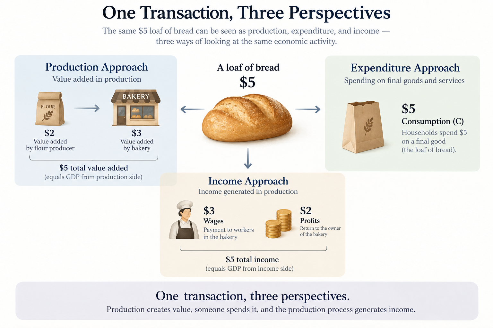

## Three Different Questions, One Answer?

Gross Domestic Product (GDP) is one of the most familiar measures in economics. But there is something about GDP accounting that initially seems strange: economists can calculate GDP in three different ways—the production approach, the expenditure approach, and the income approach—and, in principle, obtain exactly the same answer.

At first, these approaches seem to measure completely different things. The production approach asks how much value an economy produces. The expenditure approach asks how much is spent on final goods and services. The income approach asks how much income is generated in the production process. Why should these three numbers be equal?

## Following One Transaction

Consider a simple example. Suppose I buy a loaf of bread from a bakery for $5. From the expenditure side, this is straightforward: I have spent $5 on a final consumption good, so it contributes $5 to consumption.

From the production side, we measure the value added in producing the bread. If the bakery uses $2 of flour produced by another firm and sells the bread for $5, the bakery adds $3 of value. The flour producer contributes the other $2. Across the whole production chain, total value added is therefore still $5. This is why GDP counts value added rather than simply adding up every transaction: otherwise intermediate goods such as flour would be counted twice.

Finally, the value created through production generates income. Across the entire production chain, the $5 of value added ultimately appears as income, such as wages and profits. Thus, the same economic activity appears as $5 of production, $5 of expenditure, and $5 of income.

$$
\text{Production} = \text{Expenditure} = \text{Income}
$$
{width=90%}

## What If Nobody Buys the Bread?

Now consider a less intuitive case. Suppose the $5 loaf is produced, but nobody buys it before the end of the accounting period. Has GDP fallen by $5?

No. The production approach has not changed: the bread was still produced during the period. What changes is its classification under the expenditure approach. Instead of appearing as $5 of consumption, the unsold bread is recorded as $5 of inventory investment. Therefore, total GDP is unchanged.

$$
C \downarrow \$5,\qquad I_{\text{inventory}} \uparrow \$5
$$

The income approach also remains consistent. Income generated by production does not require the final product to have already been sold for cash. The unsold bread becomes an inventory asset of the firm. In national accounting, what matters is that production occurred during the period.

This reveals an important distinction: **GDP measures current production, not simply current sales or cash receipts.**

## The Takeaway

The three approaches to GDP are not three unrelated ways of estimating the economy. They are three perspectives on the same economic activity. Production creates value, expenditure purchases final output, and the production process generates income.

Once we follow a transaction through the economy, the identity becomes much less mysterious:

$$
\boxed{\text{Production} = \text{Expenditure} = \text{Income}}
$$

The equality is not a coincidence. It is built into the way economic transactions connect buyers, producers, and income earners.