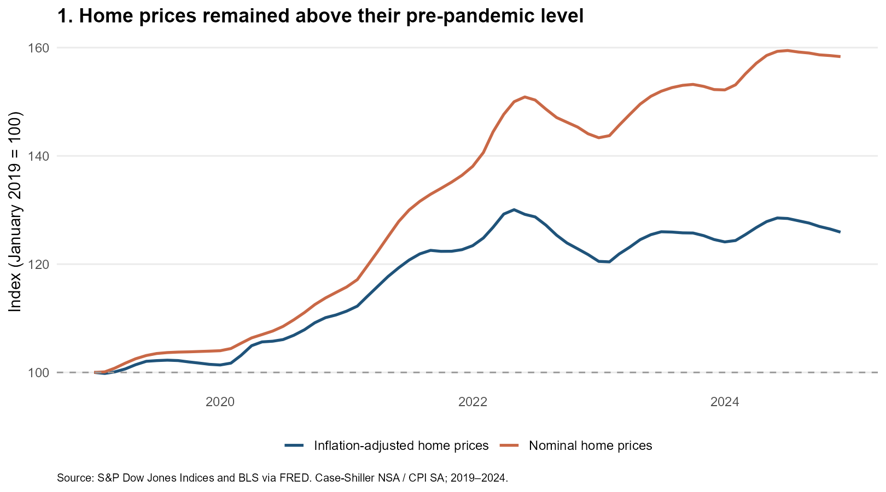
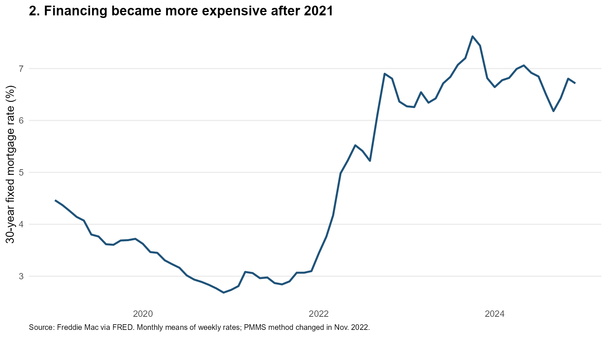
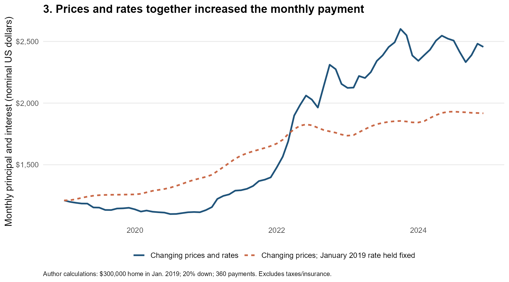

```{r}
#| label: setup
#| include: false
source('code/analyze.R')
num <- function(x) formatC(x, format = 'f', digits = 1)
usd <- function(x) paste0('$', format(round(x), big.mark = ',', scientific = FALSE, trim = TRUE))
```

Between January 2019 and December 2024, U.S. home prices rose by about `r num(metrics$price_growth)`%, while the estimated monthly mortgage payment for an illustrative new purchase rose by about `r num(metrics$payment_growth)`%. Why was the increase in the payment so much larger? For buyers who borrow, the listing price is only part of the decision: the interest rate also determines what they must pay each month. Comparing home prices and mortgage rates helps explain how the cost of financing a home changed over this period.

To explore that question, I combine three series from FRED: the Case-Shiller national home price index, Freddie Mac’s 30-year fixed mortgage rate, and the Consumer Price Index. The mortgage rates are averaged by month to match the other series. This is a descriptive comparison of national trends, rather than an estimate of the causal effect of monetary policy.

The first figure shows why looking at a dollar price alone can be misleading. By December 2024, nominal home prices were `r num(metrics$price_growth)`% above their January 2019 level. After adjustment for consumer-price inflation, the increase was smaller, at `r num(metrics$real_price_growth)`%. The smaller inflation-adjusted increase shows that home prices rose faster than the broader consumer basket, even after accounting for the decline in the purchasing power of a dollar. Both series start at 100 so their changes can be compared directly. These are national averages, which can conceal substantial local differences.

{fig-alt="Line chart comparing nominal and CPI-adjusted home price indices, both rebased to January 2019 equals 100."}

Prices are only the first part of the financing decision. The second figure shows that borrowing costs initially fell, then rose sharply after 2021. The monthly average mortgage rate increased from `r num(metrics$r0)`% in January 2019 to `r num(metrics$r1)`% in December 2024. For a given loan balance, a higher rate increases the payment needed to repay the mortgage over the same period. Lower rates early in the pandemic temporarily cushioned the effect of rising prices; later, buyers faced both a larger purchase price and more expensive credit.

{fig-alt="Monthly mortgage rate line showing the decline through 2020–2021 and the subsequent rise."}

The third figure brings these two forces together. Consider an illustrative home worth $300,000 in January 2019. Let its value subsequently move with the national price index, assume a 20% down payment, and calculate principal and interest on a new 30-year fixed loan in each month. The estimated payment rises from `r usd(metrics$m0)` to `r usd(metrics$m1)`, an increase of about `r num(metrics$payment_growth)`%. This is a comparison of hypothetical new loans, not the changing payment on one existing fixed-rate mortgage.

{fig-alt="Two payment paths comparing changing prices and mortgage rates against changing prices with a fixed January 2019 interest rate."}

For comparison, the dashed line holds the interest rate at its January 2019 value while allowing home prices to change. Under that scenario, the December 2024 payment would be approximately `r usd(metrics$price_only)`. The gap between the lines isolates the mechanical effect of changing the rate for the same month’s loan balance. It does not predict what house prices would actually have been if rates had stayed low: prices and financing conditions can influence one another.

The dollar payments also need context. Adjusting for consumer-price inflation, the increase in the estimated payment is about `r num(metrics$real_payment_growth)`%, still substantial. But this calculation excludes property taxes, insurance, maintenance, closing costs, and changes in household income. The $300,000 starting value is an illustrative assumption, not an estimated national median. Holding the down-payment percentage constant also requires more cash as prices rise. Consequently, the figures measure financing pressure rather than a complete payment-to-income affordability ratio.

The takeaway is that slower price growth alone does not guarantee relief for new buyers. The price of the home and the price of borrowing jointly determine the monthly commitment. Evaluating a purchase therefore requires looking beyond the listing price to financing terms, upfront cash, and income. These figures show how that distinction became especially consequential between 2019 and 2024.

Data: [Case-Shiller home price index](https://fred.stlouisfed.org/series/CSUSHPINSA), [Freddie Mac mortgage rate](https://fred.stlouisfed.org/series/MORTGAGE30US), and [BLS Consumer Price Index](https://fred.stlouisfed.org/series/CPIAUCSL), retrieved from FRED on October 6, 2026. Code, data, and replication instructions: [GitHub repository](https://github.com/yiranzh1003/mywebsite/tree/main/blog/posts/post4).
